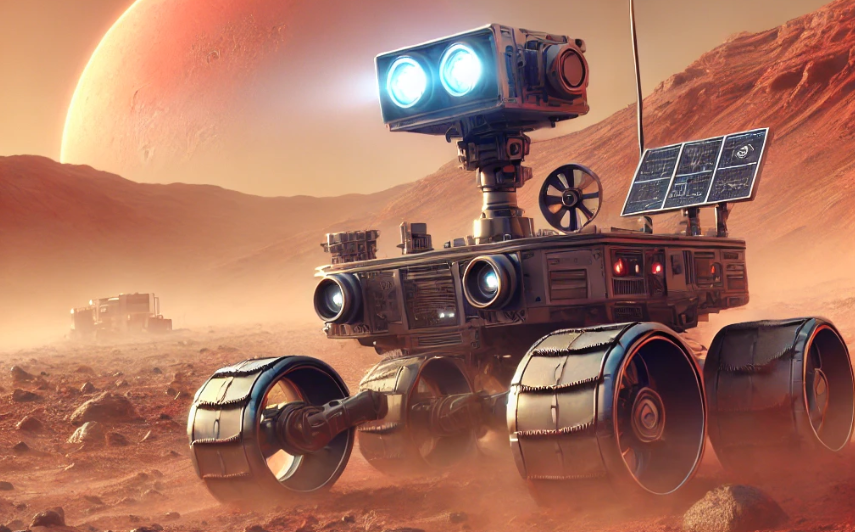

# ✨ **Mars Rover Navigation System** ✨

## 🌍 Overview
This project, developed by **Mohamed Waleed**, implements a **Mars Rover navigation system** that allows a rover to move within a grid while avoiding obstacles and finding the best path to a target location.

---

## ✨ **Features**

### 🔹 1. **Basic Movement**
- The rover can move **forward (F)** and **backward (B)**.
- It can rotate **left (L)** and **right (R)**.
- **🛠️ Technology Used:** JavaScript classes, modular programming

### 🔹 2. **Obstacle Detection**
- The rover detects obstacles and stops before colliding.
- **🛠️ Technology Used:** Set data structure for fast lookup of obstacle positions

### 🔹 3. **Command Processing**
- The rover processes a string of commands to execute movements sequentially.
- **🛠️ Technology Used:** String parsing and iterative execution

### 🔹 4. **Pathfinding (Best Path to Target)**
- The rover calculates the best path to a given coordinate while avoiding obstacles.
- **🛠️ Technology Used:** **BFS (Breadth-First Search) algorithm** for shortest pathfinding

---

## ⚙️ **Installation**
```sh
npm install
```

---

## 🏭 **Usage**
```js
const Rover = require('./rover');

const rover = new Rover(4, 2, 'EAST', [[1,4], [3,5], [7,4]]);
console.log("Initial position:", rover.getPosition());

const safePath = rover.findSafePath(8, 5);
console.log(`Safe path to (8, 5): ${safePath}`);
rover.processCommands(safePath);
console.log("After following safe path:", rover.getPosition());
```

---


---

## ✨ **Developed with passion by Mohamed Waleed** ✨ 🚀

